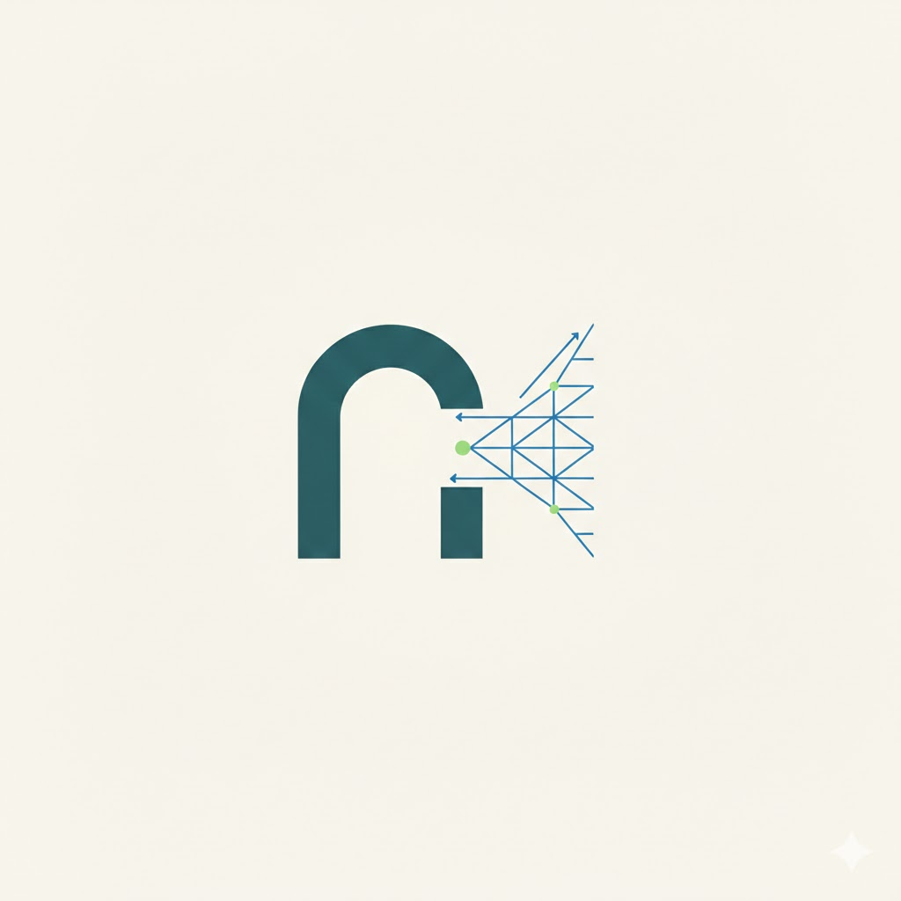

<p align="center">
  
</p>

# ArchMeshRubbing

<p align="center">
  <strong>스캔 유물을 기록면과 검증 가능한 연구 산출물 중심으로 다루는 Windows 데스크톱 도구</strong>
</p>

ArchMeshRubbing은 3D 메쉬를 단순한 CG 자산이 아니라 원본, 단위, 정위치, 실측 기록과 결과 파일이 서로 연결된 연구 자료로 다룹니다. 목표 흐름은 다음과 같습니다.

```text
Open → 단위·축 확인 → Align 확정 → Cutline → Outline → Digital Rubbing → 1:1 export → offline 검증
                                      └──────── 기와 기록면 전개 ────────┘
```

> **현재 단계:** 실제 유물 파일을 가져와 시험할 수 있는 Windows source 버전입니다. 원본·단위·Align·기록·산출물·오프라인 검증을 잇는 신뢰 기반은 구현됐고, 이제 대표 실물과 고고학자의 현장 검증 및 남은 실무 모듈을 채우는 단계입니다. 완성된 상용 대체품이나 공개 안정판으로 주장하지 않습니다.

[Windows 설치](#windows-설치와-실행) · [첫 실물 테스트](#내-스캔-파일로-첫-실물-테스트) · [기와 전개](#기와-기록면-전개-시험) · [결과 검증](#결과-파일과-오프라인-검증) · [문제 해결](#문제-해결)

## 지원 환경과 배포 상태

| 항목 | 현재 계약 |
|---|---|
| 운영체제 | Windows 10 version 1809(build 17763) 이상 x64, Windows 11 x64 |
| 실행 환경 | native AMD64 PC, 64-bit CPython 3.12 |
| 그래픽 | OpenGL 2.1 compatibility profile, 24-bit 이상 depth buffer |
| 현재 설치 방식 | 저장소를 받은 뒤 source로 실행 |
| 공개 바이너리 | 서명된 installer 또는 다운로드용 portable ZIP을 아직 제공하지 않음 |
| 네트워크 | 의존성 설치에는 인터넷이 필요하지만 핵심 기록·저장·검증은 계정과 서버 없이 offline 실행 |

Windows ARM64, x64-on-ARM64 에뮬레이션, 32-bit Windows, Windows Server, macOS, Linux, WSL, Wine/Proton은 지원하지 않습니다. installer, MSIX, Microsoft Store 패키지도 현재 목표가 아닙니다.

저장소 source는 `Apache-2.0`이고, PyQt6를 포함한 바이너리는 결합물로서 `GPL-3.0` 조건으로 전달됩니다. 라이선스상 공개 배포를 막는 요인은 없으며, 남은 것은 서명과 대표 하드웨어 파일럿입니다. 자세한 내용은 [native packaging 정책](docs/NATIVE_PACKAGING.md)을 참고하세요.

## 지금 할 수 있는 일

### 검증 기록 경로

| 작업 | 현재 가능한 내용 | 주 산출물 |
|---|---|---|
| 원본 불러오기 | OBJ, PLY, STL, OFF, glTF, GLB와 허용된 상대 로컬 리소스 검증 | self-contained `.amr` |
| 단위·좌표축 확인 | `mm/cm/m`, signed X/Y/Z 매핑과 handedness 확인 | metadata revision |
| 정위치 | 이동·회전 preview를 명시적으로 확정하고 이전 Align revision 복원 | immutable Align 이력 |
| 단면 | Top, Front, Right의 canonical-mm Cutline | `.amr-vector` 1:1 SVG |
| 외곽 | 6면 Outline, 정밀도 격자, 오목부·구멍·분리 성분 보존 | `.amr-vector` 1:1 SVG |
| 디지털 탁본 | 6면, 해상도·여백·깊이·먹 농도·양각/음각 설정 | `.amr-rubbing` 1:1 PNG |
| 제작 기법 (홈) | 정치한 토기를 한 바퀴 도는 홈을 profile에서 찾아 기록 | 도판에 간선 1줄 + 직선 2줄 |
| 제작 기법 (흔적) | 메쉬 위에 칠한 면 집합을 테쌓기흔·지두흔·타날흔·물손질흔·목리조정흔으로 기록. 상태 표기와 같은 면 집합 규율 | 도판에 경계선; 지두흔은 U자 기호 |
| 전개 탁본 | 기와 전개 record의 펴진 좌표 위에 같은 요철을 그린 탁본 (정치한 토기의 외면 띠 포함) | `.amr-rubbing` 1:1 PNG (sidecar 1.3.0) |
| 실측 도판 | 입면·단면·탁본을 한 축척으로 배치하고 축척바·제목란을 붙인 페이지. 선 종류별 굵기는 pt 또는 mm로 직접 넣을 수 있고 그 표가 provenance에 남는다. 탁본이 실리면 제목란과 탁본 아래에 "3D 메쉬에서 계산 · 종이 탁본 아님"과 먹을 만든 수치가 반드시 찍히며, 전개면 위의 탁본과 정사영 요철 그림은 캡션으로 구분된다 | `.svg` + provenance |
| 완료 실측 | Cutline 3 + Outline 6 + Rubbing 6의 15개 결과 결합 | `.amr-survey` |
| 제원 측정 | 표면적, 조건부 체적, 두 점 거리, 선택점 best-fit 원 지름 | 검증 가능한 measurement record |
| 기와 전개 | 전체/선택 면, X/Y/Z 장축, Top/Bottom 해석, 자동/고정 seam, 왜곡 QC | `.amr-unwrap` OBJ·1:1 SVG |
| 오프라인 검증 | 프로젝트와 네 종류 export의 hash·단위·Align·record·QC 재검증 | JSON receipt |

Open 직후의 identity Align은 계산 기준일 뿐 기록자가 정위치를 확인한 증거가 아닙니다. 변화량이 `0`이어도 `정치 확정`을 한 번 눌러야 실측과 기와 전개가 열립니다.

정식 작업 순서는 `Cutline 3/3 → Outline 6/6 → Digital Rubbing 6/6`입니다. 선행 기록이 `READY + FRESH`일 때만 다음 기능이 활성화되고 완료 버튼이 초록색으로 바뀝니다. Align을 변경하면 기존 기록을 삭제하지 않고 이전 revision의 stale 이력으로 보존하며, 현재 완료 판정과 export에서는 제외합니다.

### 화면·보조 기능

- 6방향 표준 시점, 원근/정사영 보기, 메쉬 맞춤과 뷰 초기화
- 직접 만든 16×16 pixel icon을 사용하는 Windows UI
- Flat Shading과 선택 메쉬 투명 X-Ray 보기
- 클릭·브러시·올가미·가시면 기반 기록면 선택 및 외면/내면/미구 연구용 라벨링
- 기와 유형·분할 가설, 길이축 힌트, 대표 단면, 와통 피팅과 합성 기와 benchmark
- 중단된 `.amr` 저장 후보를 검증해 새 파일로 복구하는 기능
- 파일·메쉬 정보와 디버그 정보 복사

X-Ray는 화면에서 선택 메쉬를 투명하게 보는 보조 기능입니다. CT 데이터 분석이나 내부 구조의 검증 산출물은 아닙니다. 빠른 flatten, review sheet, 일반 6방향 도면 같은 legacy 경로도 남아 있지만 학술적 1:1 결과로 사용할 때는 `검증된 실측 · ArtifactDocument` 패널의 record와 `.amr-*` package를 사용하세요.

## 지원 파일

| 형식 | 비고 |
|---|---|
| `.obj` | 상대 경로의 MTL과 texture를 함께 캡처 가능 |
| `.ply` | ASCII/binary 및 상대 `TextureFile` 처리 |
| `.stl` | ASCII/binary |
| `.off` | text mesh |
| `.gltf` | self-contained 또는 원본 폴더 아래 상대 buffer/image |
| `.glb` | glTF Binary |

HTTP/file URI, 절대 resource 경로, 원본 폴더 밖으로 나가는 `..`, symlink 탈출은 허용하지 않습니다. OBJ나 glTF처럼 부속 파일이 있는 자료는 파일 하나만 떼지 말고 원래의 상대 폴더 구조 전체를 복사하세요.

UV와 texture bytes의 프로젝트 보존·오프라인 재현은 검증하지만 여러 material/PBR 조합의 화면 렌더링 충실도는 아직 현장 검증 전입니다. 현재 authoritative SVG, PNG와 기와 전개는 geometry 중심 산출물입니다.

현재 import 상한은 주 원본 4 GiB, text parser 입력 256 MiB, 5,000,000 vertices, 2,000,000 triangles입니다. 기와 전개의 선택 기록면은 최대 250,000 faces입니다. 첫 시험은 원본을 보존한 채 충분히 작은 decimated 복사본으로 시작하는 편이 좋습니다. parser는 아직 별도 보안 process sandbox가 아니므로 출처와 내용을 신뢰할 수 있는 스캔만 여세요.

## Windows 설치와 실행

### 1. 준비

- Windows 10/11 x64 PC
- [CPython 3.12 x64](https://www.python.org/downloads/windows/)와 Python Launcher
- [Git for Windows](https://git-scm.com/download/win)
- 최초 Python package 설치를 위한 인터넷 연결

Python 3.11, 3.13 등 다른 버전을 대신 사용하지 마세요. PowerShell에서 다음 명령으로 3.12 x64가 보이는지 먼저 확인할 수 있습니다.

```powershell
py -0p
py -3.12 -c "import platform,struct; print(platform.python_version(), platform.machine(), struct.calcsize('P') * 8)"
```

마지막 숫자가 `64`여야 합니다.

### 2. source 설치

일반 PowerShell을 열고 다음 명령을 그대로 실행합니다. 가상환경을 activate하지 않고 그 안의 Python을 직접 호출하므로 PowerShell ExecutionPolicy와 다른 Python의 `pip`가 섞이는 문제를 피할 수 있습니다.

```powershell
git clone https://github.com/lzpxilfe/ArchMeshRubbing.git
Set-Location .\ArchMeshRubbing

py -3.12 -m venv .venv
.\.venv\Scripts\python.exe -m pip install --upgrade pip
.\.venv\Scripts\python.exe -m pip install -r requirements.txt
.\.venv\Scripts\python.exe -m pip check
```

Git을 쓰지 않는다면 GitHub의 `Code → Download ZIP`으로 source를 받은 뒤 압축을 풀고, PowerShell에서 그 폴더로 이동해 `py -3.12 -m venv .venv`부터 실행하면 됩니다.

`requirements-optional.txt`는 legacy 실험용입니다. 일반 실행과 검증형 기능 시험에는 설치하지 않아도 됩니다.

### 3. 설치 확인

```powershell
.\.venv\Scripts\python.exe main.py --version

$report = Join-Path $env:TEMP ("ArchMeshRubbing-self-test-{0}.json" -f (Get-Date -Format "yyyyMMdd-HHmmss"))
.\.venv\Scripts\python.exe main.py --self-test-report $report
Write-Host "Self-test report: $report"
$result = Get-Content $report -Raw | ConvertFrom-Json
$result.ok
$result.checks | Where-Object { -not $_.ok }
```

두 명령의 종료 코드가 `0`이고 `$result.ok`가 `True`이며 실패 check가 출력되지 않으면 고정 Python package, Qt offscreen shell, parser, 프로젝트 왕복, 3/6/6 실측, 측정과 기와 전개를 포함한 통합 self-test가 통과한 것입니다. 실행 중 잠시 출력이 없을 수 있습니다. 이 검사는 실제 Windows 화면 frame까지 증명하지 않습니다. 지원 Windows runtime은 GUI 시작 때 다시 강제되며 native frame은 [OpenGL 진단](#창이-검게-보이거나-opengl-오류가-남)으로 별도 확인할 수 있습니다. report는 기존 파일을 덮어쓰지 않으므로 예시는 매번 새 시각 이름을 만듭니다.

### 4. 앱 실행

```powershell
.\.venv\Scripts\python.exe main.py --gui
```

특정 파일이나 프로젝트를 바로 열 수도 있습니다.

```powershell
.\.venv\Scripts\python.exe main.py --open-mesh "D:\scans\roof-tile.ply"
.\.venv\Scripts\python.exe main.py --open-project "D:\results\roof-tile.amr"
```

이후 다시 실행할 때는 저장소 폴더에서 마지막 `--gui` 명령만 사용하면 됩니다.

### 선택 사항: 로컬 unsigned 실행 파일 만들기

이 과정은 설치 프로그램을 만들지 않습니다. 검증된 onedir 폴더와 선택적인 portable ZIP을 만들며, 폴더 안의 파일을 함께 유지해야 합니다. source 실행에 사용한 폴더에는 Python cache나 시험 자료가 생길 수 있으므로 **별도의 fresh clone**에서 빌드하세요.

```powershell
git clone https://github.com/lzpxilfe/ArchMeshRubbing.git ArchMeshRubbing-build
Set-Location .\ArchMeshRubbing-build

py -3.12 -m venv .venv
$env:PYTHONDONTWRITEBYTECODE = "1"
.\.venv\Scripts\python.exe -m pip install --require-hashes --only-binary=:all: -r requirements\windows-py312-x64-hashed.lock
.\.venv\Scripts\python.exe -m pip check
.\.venv\Scripts\python.exe tools\build_native.py
```

빌드가 끝나면 자체 검사를 통과한 실행 파일이 `dist\ArchMeshRubbing\ArchMeshRubbing.exe`에 생깁니다. 이미 `build`/`dist` 결과가 있거나 Git worktree가 깨끗하지 않으면 안전을 위해 중단합니다.

portable ZIP까지 만들려면 이어서 실행합니다.

```powershell
$epoch = [int64]((& git show -s --format=%ct HEAD).Trim())
.\.venv\Scripts\python.exe tools\build_portable_archive.py build `
  --payload dist\ArchMeshRubbing `
  --archive build\ArchMeshRubbing-Windows-x64-portable.zip `
  --manifest build\ArchMeshRubbing-Windows-x64-portable.zip.manifest.json `
  --source-date-epoch $epoch

.\.venv\Scripts\python.exe tools\build_portable_archive.py verify `
  --archive build\ArchMeshRubbing-Windows-x64-portable.zip `
  --manifest build\ArchMeshRubbing-Windows-x64-portable.zip.manifest.json
```

생성물은 unsigned 로컬 시험용입니다. 공개 배포, 서명, 설치 등록은 수행하지 않습니다.

## 내 스캔 파일로 첫 실물 테스트

### 시험 전에 준비할 것

1. 유일한 원본이 아닌 **복사본**을 준비합니다.
2. 스캐너 또는 export 설정에서 실제 단위가 `mm`, `cm`, `m` 중 무엇인지 확인합니다.
3. 축 방향과 실제로 알고 있는 길이 한 곳을 적어둡니다. 나중에 1:1 scale을 대조할 기준입니다.
4. OBJ·glTF·texture 자료는 부속 파일과 상대 폴더 구조를 함께 복사합니다.
5. 처음에는 한 유물, 한 연결 mesh, 가능한 한 작은 시험본으로 시작합니다.

### 기본 실측 한 바퀴

1. `4축 작업 흐름 → 메쉬 열기`에서 복사한 파일을 엽니다.
2. `원본 단위·좌표축 확인`에서 단위와 signed 축 매핑을 실제 scan 설정대로 선택하고 확인란을 체크합니다. 모르면 추정하지 말고 scanner/export 설정을 먼저 확인하세요.
3. 화면에서 형상과 크기를 확인합니다. 선택·측정 도구가 꺼진 기본 카메라 모드의 조작은 `좌클릭 드래그=회전`, `우클릭 드래그=이동`, `휠=확대·축소`입니다. `1~6`은 정면·후면·우측·좌측·상면·하면, `F`는 메쉬 맞춤, `R`은 뷰 초기화입니다.
4. 상단 정위치 툴바에서 이동·회전 값을 조절합니다. native 문서에서는 scale로 단위를 보정하지 않습니다. 현재 `바닥면 맞춤`, 3점·면·브러시 자동 바닥 정렬은 검증 Align revision으로 아직 이식되지 않았으므로 수동 이동·회전을 사용합니다.
5. 자세가 맞으면 변화량이 `0`이어도 `정치 확정`을 누릅니다. 이때 immutable Align revision이 생기고 검증 실측 버튼이 열립니다.
6. `Ctrl+S`로 `roof-tile.amr` 같은 프로젝트를 먼저 저장합니다. 창 제목의 `*`는 현재 문서에 저장되지 않은 변경이 있다는 뜻입니다.
7. `검증된 실측 · 기와 전개 열기`를 누릅니다.
8. Cutline에서 Top, Front, Right를 각각 선택하고 필요한 mm 평면 위치를 정해 `단면 계산 · 기록`을 실행합니다.
9. Cutline이 `3/3`이 되면 Outline의 6면을 각각 `외곽 계산 · 기록`합니다. 외곽 정밀도 격자보다 좁은 특징은 합쳐질 수 있으므로 결과와 QC를 확인합니다.
10. Outline이 `6/6`이 되면 Digital Rubbing의 6면을 각각 선택해 `탁본 계산 · 기록`을 실행합니다. 실제 크기가 큰 유물에서 `px/mm`를 지나치게 높이면 raster가 매우 커질 수 있으므로 기본값부터 시험하세요.
11. 완료 버튼이 초록색이고 진행도가 `3/3 · 6/6 · 6/6`인지 확인합니다. 아직 export하지 않습니다.
12. `제원측정 도구 열기`에서 표면적·체적, 두 점 거리, 선택점 원 맞춤 지름을 필요에 따라 기록합니다.
13. 기와 전개도 시험한다면 아래 절차로 전개 record까지 먼저 만듭니다. 모든 record가 준비된 뒤 [저장과 export 순서](#저장과-export-순서)를 따릅니다.

거리는 표면을 따라가는 geodesic이 아니라 두 surface anchor 사이의 **3D 직선 거리**입니다. 지름은 유물의 최대 외경이 아니라 3~64개 선택점을 best-fit한 평면 원의 지름입니다. 체적은 단일 연결·폐쇄·일관된 winding의 edge-manifold mesh에서만 제공하며, 열린 mesh나 비다양체·다중 조각에서는 근사값으로 위장하지 않고 unavailable로 남깁니다.

### 기와 기록면 전개 시험

기와 전개는 Align 확정 직후부터 별도로 시험할 수 있습니다.

1. 두꺼운 폐합 mesh 전체보다 외면 또는 내면 중 실제로 기록할 **한쪽 open surface patch**를 고릅니다. `표면 보정 도구`의 가시면·클릭·브러시·올가미 선택을 사용할 수 있습니다.
2. `기록 영역`을 `현재 선택 면`으로 바꾸고, 정렬된 기와의 길이축 `X/Y/Z`를 직접 지정합니다.
3. `상면/하면`은 표면 자동 분류가 아니라 같은 선택면의 펼침 방향 해석입니다. 올바른 기록면 선택은 사용자가 확인해야 합니다.
4. 펼침 경계는 먼저 `자동 경계`, 단면 수는 기본 `32`로 시험하세요. 허용 범위는 `12~96`입니다.
5. 경계를 연구자가 고정해야 하면 `고정 각도`를 선택해 `[-180°, 180°)` 범위의 값을 지정합니다.
6. `기와 전개 계산 · 기록` 후 section fit, 왜곡, collapse, foldover, overlap QC를 확인합니다. 실패를 억지로 export하지 말고 기록면 선택·장축·seam을 다시 확인합니다.
7. READY + FRESH 결과가 만들어졌는지 확인합니다. 모든 기록을 마친 뒤 아래 공통 순서에서 저장하고 export합니다.

정식 전개 record가 통과하려면 선택 patch는 하나의 edge-connected component이고, 최소 하나의 닫힌 비분기 경계 고리를 가진 open surface이며, triangle orientation이 일관돼야 합니다. duplicate face, non-manifold edge와 폐합 shell 전체는 거부됩니다. 선택면 내부를 가르는 고정 seam은 foldover나 overlap을 만들면 거부될 수 있습니다. 토기 외면의 띠는 손으로 칠하지 않아도 됩니다. `회전축 기준 외면 띠`에 기준 자오선 각도, 띠 폭, 높이 범위를 넣고 `외면 띠 선택`을 누르면 정치한 축을 기준으로 외면만 잘라 현재 선택 면으로 둡니다. 안팎은 면 법선의 방향과 두 겹의 반지름 대소를 함께 보고 가리며, 뒤집힌 메쉬는 안쪽 벽을 내주는 대신 거부합니다.

펼친 좌표 위에 요철을 직접 그리는 전개 탁본은 있습니다. READY + FRESH 전개 기록을 고른 뒤 `선택한 전개 위에 탁본 계산 · 기록`을 누르면 탁본 항목의 해상도·기준 반경·검정 기준 깊이·먹 농도·극성으로 전개 위의 탁본 raster를 만들고, 탁본 기록 목록에서 골라 같은 1:1 PNG 패키지로 내보냅니다. 배경과 실측 수치는 [`docs/POTTERY_STRIP_UNWRAP.md`](docs/POTTERY_STRIP_UNWRAP.md)에 있습니다. 원본 texture를 펼친 좌표 위에 재투영하는 기능은 아직 없습니다.

### 저장과 export 순서

모든 export는 **생성 당시의 전체 프로젝트 hash**에 결박됩니다. 따라서 record를 모두 만든 다음 프로젝트를 저장하고, 그 exact 상태에서 export해야 합니다.

1. 원하는 Cutline, Outline, Rubbing, 제원과 기와 record를 모두 마칩니다.
2. `Ctrl+S`로 최신 문서를 `.amr`에 저장합니다.
3. 필요한 Cutline/Outline record를 선택해 `선택한 검증 벡터 1:1 SVG 내보내기`로 `.amr-vector`를 만듭니다.
4. 필요한 Rubbing record를 선택해 `선택한 검증 탁본 1:1 PNG 패키지 내보내기`로 `.amr-rubbing`을 만듭니다.
5. 진행도가 `3/3 · 6/6 · 6/6`이면 `완료 실측 15개 원자 묶음 내보내기`로 `.amr-survey`를 만듭니다.
6. 기와 전개를 기록했다면 READY + FRESH 결과를 선택해 `선택한 검증 전개 1:1 OBJ · SVG 패키지 내보내기`로 `.amr-unwrap`을 만듭니다.
7. 이후 Align이나 record를 추가·변경했다면 `Ctrl+S` 후 필요한 package를 새 이름으로 다시 export합니다. 이전 package는 생성 당시 프로젝트의 증거이므로 최신 `.amr`와 `--against-project` exact-match하지 않습니다.
8. 앱을 닫았다가 저장한 프로젝트를 재개방합니다.

### 프로젝트 독립성 확인

1. 저장한 `.amr`를 다른 시험 폴더에 복사합니다.
2. 앱을 완전히 닫습니다.
3. 원본 **복사본** 폴더의 이름을 바꾸거나 다른 곳으로 옮깁니다. 유일한 원본은 삭제하지 마세요.
4. 복사한 `.amr`를 `프로젝트 열기`로 엽니다.
5. mesh, 단위, Align, record 목록과 완료 진행도가 복원되는지 확인합니다. READY + FRESH 기록을 다시 선택해 미리보기가 recipe에서 재계산되는지도 확인합니다.

신규 `.amr`는 주 원본과 parser가 실제 사용한 허용 dependency를 content-addressed blob으로 포함합니다. 이 시험이 통과하면 source 경로에 의존하지 않는 프로젝트 왕복을 확인한 것입니다.

## 결과 파일과 오프라인 검증

| 경로 | 내용 |
|---|---|
| `artifact.amr` | 내장 원본, dependency, metadata, Align과 모든 record가 있는 프로젝트 파일 |
| `*.amr-vector/` | `artifact.svg`와 vector provenance JSON |
| `*.amr-rubbing/` | `artifact.png`와 rubbing provenance JSON |
| `*.amr-survey/` | 9개 vector package, 6개 rubbing package와 aggregate manifest |
| `*.amr-unwrap/` | canonical binary, 평면 OBJ, 실제 mm 1:1 SVG와 provenance JSON |

`.amr-*` 결과는 이름에 확장자가 붙은 **폴더 package**입니다. 검증 export와 JSON report는 기존 목적지를 덮어쓰지 않으므로 재시험할 때는 새 이름을 사용하세요.

source 실행에서는 다음처럼 검증합니다.

```powershell
.\.venv\Scripts\python.exe main.py --verify-artifact "D:\results\roof-tile.amr" `
  --report "D:\results\project-verification.json"

.\.venv\Scripts\python.exe main.py --verify-artifact "D:\results\roof-tile.amr-unwrap" `
  --against-project "D:\results\roof-tile.amr" `
  --report "D:\results\unwrap-verification.json"

.\.venv\Scripts\python.exe main.py --verify-artifact "D:\results\roof-tile.amr-survey" `
  --against-project "D:\results\roof-tile.amr" `
  --report "D:\results\survey-verification.json"
```

종료 코드 `0`과 report의 `ok: true`가 성공입니다. `1`은 자료 검증 실패, `2`는 잘못된 옵션 또는 report 저장 실패입니다. 위 source 명령은 PowerShell이 process 종료를 직접 기다리므로 검증용으로 권장합니다. 로컬 GUI-subsystem EXE를 CLI에 사용할 때는 `Start-Process -Wait -PassThru`로 종료를 기다리고 `.ExitCode`를 별도로 확인해야 합니다.

마지막으로 SVG를 Illustrator 또는 Inkscape에서 열고, 알고 있는 길이를 재거나 100% scale로 출력해 자·캘리퍼스로 확인하세요. 자동 검증은 파일 내부의 mm 계약을 확인하지만 실제 printer 설정과 외부 프로그램의 import 동작까지 대신 증명하지 않습니다.

## 첫 시험 합격 체크리스트

- [ ] 설치 self-test의 `ok`가 `true`다.
- [ ] mesh가 열리고 vertex/triangle 수와 실제 단위·크기가 예상과 맞다.
- [ ] 명시적 `정치 확정` 뒤 검증 실측과 기와 전개가 활성화된다.
- [ ] `.amr` 저장, 종료, 재열기 뒤 Align과 record 진행도가 복원된다.
- [ ] Cutline/Outline/Rubbing 또는 기와 전개 결과가 READY + FRESH다.
- [ ] export package를 `--against-project`로 검증했을 때 `ok`가 `true`다.
- [ ] 외부 프로그램에서 알려진 길이와 1:1 scale이 맞다.
- [ ] 원본 파일은 수정되거나 삭제되지 않았다.

시험 결과를 공유할 때는 Windows version/build, GPU, RAM, 원본 format, 실제 단위, vertex/triangle 수, 단계별 성공 여부와 처리시간, 오류 문구, 필요한 화면 캡처를 함께 주세요. 절대 경로, 소장 위치, 미공개 유물 정보와 개인정보는 제거하세요. 정식 10항목 파일럿 절차는 [FIELD_PILOT.md](docs/FIELD_PILOT.md)에 있습니다.

## 문제 해결

### `py -3.12`를 찾지 못함

`py -0p`로 설치된 Python을 확인하고 CPython 3.12 x64를 설치하세요. ARM64 Python, 32-bit Python, 3.11/3.13은 GUI 지원 계약에 포함되지 않습니다.

### package import 실패 또는 module 없음

저장소 폴더에서 가상환경 Python을 직접 사용했는지 확인합니다.

```powershell
.\.venv\Scripts\python.exe -m pip check
.\.venv\Scripts\python.exe -c "import PyQt6,OpenGL,numpy,trimesh,shapely; print('imports ok')"
```

### 창이 검게 보이거나 OpenGL 오류가 남

그래픽 driver를 갱신한 뒤 software OpenGL 경로를 별도 PowerShell에서 시험합니다.

```powershell
$env:QT_OPENGL = "software"
$report = Join-Path $env:TEMP ("ArchMeshRubbing-opengl-{0}.json" -f (Get-Date -Format "yyyyMMdd-HHmmss"))
.\.venv\Scripts\python.exe main.py --opengl-driver-smoke-report $report
.\.venv\Scripts\python.exe main.py --gui
```

원래 환경으로 되돌리려면 `Remove-Item Env:QT_OPENGL`을 실행합니다.

### 다음 단계 버튼이 비활성화됨

- Open 뒤 `정치 확정`을 명시적으로 한 번 실행했는지 확인합니다.
- Outline 전 Cutline Top/Front/Right `3/3`, Rubbing 전 Outline 6면 `6/6`이 READY + FRESH인지 확인합니다.
- Align을 바꿨다면 이전 record는 stale이므로 현재 Align에서 다시 기록해야 합니다.

### 기와 전개가 QC에서 거부됨

전체 폐합 mesh 대신 한쪽 기록면 patch를 선택하고, 장축과 seam을 다시 확인하세요. 단면 수는 먼저 `32`, 허용 범위는 `12~96`을 사용합니다. QC failure나 fallback은 정식 결과로 게시되지 않는 것이 정상입니다.

### 로그 확인

```powershell
Get-Content "$env:LOCALAPPDATA\ArchMeshRubbing\logs\archmeshrubbing.log" -Tail 200
```

앱의 `도움말 → 디버그 정보 복사`도 함께 사용하면 실행 환경과 module 위치를 확인하기 쉽습니다.

## 아직 없는 핵심 기능

- native non-destructive Clip/Fragment revision, Cutline 위치 recall, piece list와 조각 복원
- 검증 가능한 RTI와 MSII 모듈
- 펼친 기와 좌표 위 Digital Rubbing·texture·문양선 재투영
- 실제 상면/하면을 자동 판정하는 authoritative 기록면 classifier
- 별도 Windows process와 Job Object에 격리된 mesh parser
- out-of-core 초대형 mesh 처리
- 한국어 외 전체 UI 번역, keyboard-only·고대비·확대 접근성 검증
- 서명된 공개 Windows binary와 대표 Windows 10/11 GPU·대형 실물·다수 고고학자 파일럿

현재 기능 격차와 구현 순서는 [COMPETITIVE_GAP_ANALYSIS.md](docs/COMPETITIVE_GAP_ANALYSIS.md)에 과장 없이 추적합니다.

## CLI 보조 도구

```powershell
.\.venv\Scripts\python.exe main.py --help
.\.venv\Scripts\python.exe main.py --info "D:\scans\roof-tile.ply"
.\.venv\Scripts\python.exe main.py --flatten "D:\scans\roof-tile.ply" "D:\results\quick-rubbing.tiff"
.\.venv\Scripts\python.exe main.py --review "D:\scans\roof-tile.ply" "D:\results\review.png"
.\.venv\Scripts\python.exe main.py --project "D:\scans\roof-tile.ply" "D:\results\planview.png"
.\.venv\Scripts\python.exe main.py --separate "D:\scans\roof-tile.ply"
.\.venv\Scripts\python.exe main.py --generate-synthetic sugkiwa_quarter 7 "D:\results\synthetic-tile.obj"
.\.venv\Scripts\python.exe main.py --benchmark-synthetic "D:\results\benchmarks" 1,2,3
```

`--flatten`, `--review`, `--project`, `--separate`는 빠른 legacy 검토 경로이며 ArtifactDocument의 검증 export가 아닙니다. 합성 기와의 생성물과 평가 방법은 [SYNTHETIC_BENCHMARKS.md](docs/SYNTHETIC_BENCHMARKS.md)를 참고하세요.

## 개발과 품질 확인

```powershell
.\.venv\Scripts\python.exe -m pip install -r requirements.txt -r requirements-dev.txt
.\.venv\Scripts\python.exe -m ruff check .
.\.venv\Scripts\python.exe -c "import subprocess,sys; raise SystemExit(subprocess.call([sys.executable,'-m','pyright','--pythonpath',sys.executable,'-p','pyright-m0.json']))"
.\.venv\Scripts\python.exe -m pytest -q
```

차단 품질 게이트는 Windows에서 full pytest, Ruff, M0 trust-kernel Pyright와 native `qwindows` software OpenGL frame을 검사합니다. 전체 tree Pyright는 기존 타입 부채를 계속 보고하지만 아직 차단 게이트는 아닙니다. CI와 local portable build는 실제 Windows hardware GPU, compositor presentation 또는 고고학자 판정을 대신하지 않습니다.

- [Windows CI workflow](https://github.com/lzpxilfe/ArchMeshRubbing/actions/workflows/ci.yml)
- [Windows portable package smoke](https://github.com/lzpxilfe/ArchMeshRubbing/actions/workflows/package-smoke.yml)

## 기술 문서

| 문서 | 내용 |
|---|---|
| [PROJECT_FORMAT.md](docs/PROJECT_FORMAT.md) | `.amr`, 원본 identity, 저장·재열기와 record 계약 |
| [ARCHITECTURE_DECISION.md](docs/ARCHITECTURE_DECISION.md) | 구조, 권위 경계와 단계별 개편 방향 |
| [QUALITY_GATES.md](docs/QUALITY_GATES.md) | 자동 검사 범위와 실제 증명하지 않는 것 |
| [NATIVE_PACKAGING.md](docs/NATIVE_PACKAGING.md) | Windows local build, portable, 라이선스·서명 gate |
| [FIELD_PILOT.md](docs/FIELD_PILOT.md) | 실제 유물·Windows PC·고고학자 검토 절차 |
| [COMPETITIVE_GAP_ANALYSIS.md](docs/COMPETITIVE_GAP_ANALYSIS.md) | 공개 경쟁 기능과 현재 격차 |
| [SYNTHETIC_BENCHMARKS.md](docs/SYNTHETIC_BENCHMARKS.md) | 합성 암·수키와 benchmark 사용법 |
| [FEATURE_REFERENCES.md](docs/FEATURE_REFERENCES.md) | 기능별 공개 기술 근거 |
| [REFERENCES.md](docs/REFERENCES.md) | geometry·surface reading 참고문헌 |

## 프로젝트 원칙

- 원본 mesh를 덮어쓰거나 파괴하지 않는다.
- 단위, 축, Align과 연구자의 선택을 명시적 revision으로 남긴다.
- 실패, fallback, stale 결과를 성공으로 숨기지 않는다.
- 화면 preview와 검증 가능한 연구 산출물을 구분한다.
- 핵심 작업은 계정·구독·license server 없이 offline으로 끝낸다.
- 상대 제품의 접근 제한을 우회하거나 비공개 구현을 복제하지 않는다.

## License와 Citation

Source license: Apache License 2.0 (`Apache-2.0`). 코어의 포맷·전개·탁본·검증 코드는 Qt에 의존하지 않으므로 다른 도구나 기관 시스템에서 자유롭게 재사용할 수 있고, 특허 허여가 함께 제공됩니다.

PyQt6를 포함해 만든 **바이너리**(frozen 실행 파일, portable ZIP)는 PyQt6의 `GPL-3.0-only` 때문에 결합물로서 GPL-3.0 조건으로 전달됩니다. Apache-2.0은 GPLv3과 호환되므로 이 결합은 허용되며, source만 받는 쪽에는 Apache-2.0 조건만 적용됩니다. 결합물 라이선스 원문은 [`third_party_licenses/GPL-3.0.txt`](third_party_licenses/GPL-3.0.txt), 고지 사항은 [`NOTICE`](NOTICE)에 있습니다. 공개 binary policy 상태는 다음 명령으로 확인할 수 있습니다.

```powershell
.\.venv\Scripts\python.exe tools\check_public_release_policy.py status
```

연구, 수업 또는 현장 업무에 이 저장소를 사용했다면 GitHub의 **Cite this repository** 기능을 사용해 주세요. 인용 metadata는 [CITATION.cff](CITATION.cff)에 있습니다.

[](https://github.com/lzpxilfe/ArchMeshRubbing)
[](https://github.com/lzpxilfe/ArchMeshRubbing)
