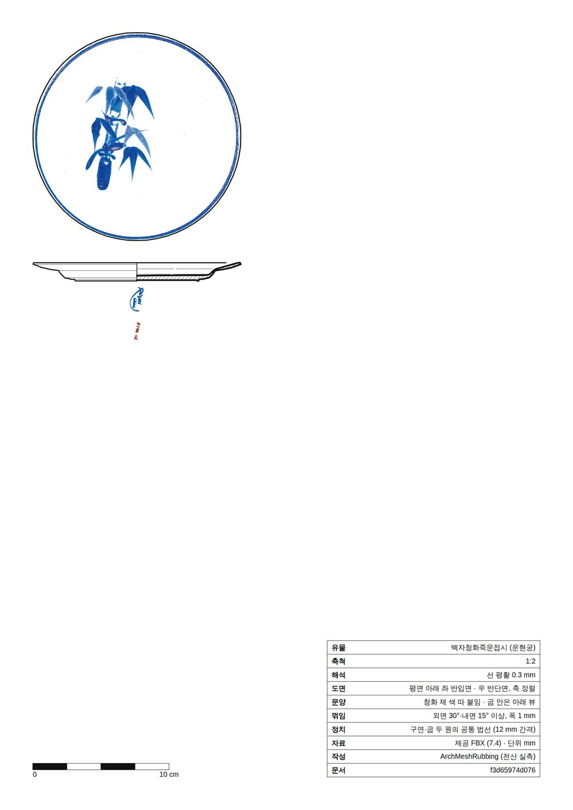
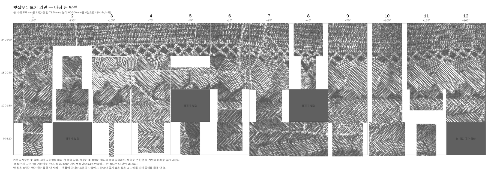

<p align="center">
  
</p>

# ArchMeshRubbing

<p align="center">
  <strong>3D 스캔한 유물에서 실측 도면을 뜹니다.<br>
  종이 위의 선 하나까지 어느 계산에서 나왔는지 되짚을 수 있게.</strong>
</p>

<p align="center">
  <a href="docs/WINDOWS_GUIDE.md">설치·실행·빌드 안내</a> ·
  <a href="#지금-할-수-있는-일">기능</a> ·
  <a href="#기술-문서">기술 문서</a>
</p>

---

## 왜 만들었나

유물 실측은 고고학의 기초 기록인데 지금도 대부분 손으로 합니다. 유물을 세우고, 축을 잡고, 캘리퍼스로 재고, 모눈종이에 옮기고, 문양은 탁본을 떠서 베낍니다. 유물 하나에 반나절이 가고, 그린 사람이 바뀌면 선도 바뀝니다.

스캔 파일을 열어 주는 프로그램은 많지만 대개 **보여 주는** 데까지입니다. 실측 도면은 보기 좋은 그림이 아니라 **기록**이고, 기록에는 규칙이 있습니다 — 단면은 굵게 빗금 쳐서, 외형선은 그보다 가늘게, 꺾이는 자리는 한 바퀴 도는 내선으로, 어디를 어떻게 쟀는지 제목란에. **ArchMeshRubbing은 그 규칙을 코드에 넣은 도구입니다.** 재고 그리는 것은 프로그램이 하고, **무엇이 유물이고 무엇이 해석인지는 실측자가 정합니다.**

## 이런 것이 나옵니다

<p align="center">
  
</p>

<p align="center"><sub><strong>백자청화죽문접시(운현궁)</strong> · A4 1:2 · 평면 + 좌 반입면·우 반단면 · 청화는 선으로 옮기지 않고 스캔의 색 그대로 따 붙임</sub></p>

<p align="center">
  
</p>

<p align="center"><sub><strong>빗살무늬토기(국립중앙박물관 신수22891)</strong> · 외면 한 바퀴 858 mm를 12칸 x 4단으로 나눠 뜬 전산 탁본 44장</sub></p>

배부른 항아리의 겉면은 **한 장으로는 펼 수 없습니다.** 늘이지 않고 펴지는 면은 가우스 곡률이 0인 면뿐인데(Theorema Egregium) 이 토기는 문양 벽만 해도 −127°가 나오고, 한 장으로 누르면 자오선이 96.7% 늘어납니다. 그래서 종이 탁본이 하는 그대로 나눠 뜹니다 — 폭 71.5 mm면 늘어남이 1.5% 안쪽이고 문양은 이음매를 건너 이어집니다. 빈 칸은 스캔에 뚫린 자리라 종이를 못 댄 곳이고, 프로그램은 메우지 않고 비워 둡니다.

> **원본 자료.** 저장소에는 도면과 탁본만 있고 스캔 메쉬·텍스처는 넣지 않습니다. 다만 접시 도판의 청화는 스캔 채색에서 따온 픽셀을 사영한 것이라 그 SVG 안에 유물 채색 일부가 이미지로 들어 있습니다. 빗살무늬토기는 [국립중앙박물관 3D 데이터](https://www.museum.go.kr/MUSEUM/contents/M0505000000.do)(신수22891, 공공누리 제1유형 — 출처표시)이고 같은 파일로 위 결과를 그대로 재현할 수 있습니다.

## 무엇이 다른가

**도면 규칙이 코드 안에 있습니다.** 선 굵기는 한국문화유산협회 실측 교재의 펜 굵기(단면 0.6 · 입면 0.4 · 결실부 0.1 mm)로 열리고, 단면 빗금·중심축선·꺾임 내선·축척바·제목란이 관례대로 나옵니다.

**모든 선을 검산할 수 있습니다.** 도면과 함께 provenance JSON이 나오고 도형마다의 실측 크기, 배치 종류, 중심축의 근거가 된 Align recipe, 꺾임선마다 실선·간선·생략 중 무엇이었는지가 적힙니다. 종이 위의 선과 sidecar의 숫자는 같은 계산에서 나오므로 어긋날 수 없고, 계정도 서버도 없이 오프라인에서 다시 검증됩니다.

```bat
python -c "from pathlib import Path; from src.core.drawing_sheet import validate_drawing_sheet_bytes; validate_drawing_sheet_bytes(Path('docs/images/dish-plate.svg').read_bytes(), Path('docs/images/dish-plate.provenance.json').read_bytes()); print('OK')"
```

**프로그램은 제안하고, 실측자가 정합니다.** 축을 세울 수 없으면 세운 척하지 않고 거부합니다. 메쉬가 뒤집혀 있으면 안쪽 벽을 내주는 대신 멈춥니다. 펼 수 없는 면은 펴지지 않는다고 말합니다.

> **현재 단계:** 실제 유물 파일을 가져와 시험할 수 있는 Windows source 버전입니다. 원본·단위·Align·기록·산출물·오프라인 검증을 잇는 신뢰 기반은 구현됐고, 이제 대표 실물과 고고학자의 현장 검증 및 남은 실무 모듈을 채우는 단계입니다. 완성된 상용 대체품이나 공개 안정판으로 주장하지 않습니다.

## 시작하기

Windows 10 1809 이상 x64 또는 Windows 11 x64, CPython 3.12 x64가 필요합니다.

```powershell
git clone https://github.com/lzpxilfe/ArchMeshRubbing.git
Set-Location .\ArchMeshRubbing

py -3.12 -m venv .venv
.\.venv\Scripts\python.exe -m pip install -r requirements.txt
.\.venv\Scripts\python.exe main.py --gui
```

Python을 깔 수 없는 PC에 옮겨 쓰려면 실행 파일로 만들 수 있습니다(서명되지 않은 로컬 빌드).

```powershell
.\.venv\Scripts\python.exe tools\build_native.py
```

**설치 확인(self-test), 실행 파일 만들기와 다른 PC로 옮기기, 첫 실물 테스트 절차, export·오프라인 검증, 문제 해결은 [Windows 설치·실행·빌드 안내](docs/WINDOWS_GUIDE.md)에 있습니다.**

작업 흐름은 이렇습니다.

```text
Open → 단위·축 확인 → Align 확정 → Cutline → Outline → Digital Rubbing → 1:1 export → offline 검증
                                      └──────── 기와 기록면 전개 ────────┘
```

Open 직후의 identity Align은 계산 기준일 뿐 정위치를 확인한 증거가 아닙니다. 변화량이 `0`이어도 `정치 확정`을 한 번 눌러야 실측과 전개가 열립니다. 선행 기록이 `READY + FRESH`일 때만 다음 단계가 활성화되고, Align을 바꾸면 기존 기록은 지워지지 않고 stale 이력으로 보존됩니다.

## 지금 할 수 있는 일

| 작업 | 산출물 |
|---|---|
| 원본 불러오기 — OBJ·PLY·STL·OFF·glTF·GLB와 허용된 상대 리소스 | self-contained `.amr` |
| 단위·좌표축 확인, 정위치(회전축·두 원의 공통 법선·굽 세우기·와통 축) | immutable Align 이력 |
| 단면 3면 · 외곽 6면 — canonical-mm 벡터 | `.amr-vector` 1:1 SVG |
| 디지털 탁본 6면, 전개면 위의 탁본(눌러 붙인 종이 모델) | `.amr-rubbing` 1:1 PNG |
| 기와·토기 기록면 전개, 언더컷 제외, 왜곡 QC | `.amr-unwrap` OBJ·1:1 SVG |
| 제작 기법(홈·테쌓기흔·지두흔·타날흔·물손질흔·목리조정흔)과 유물 상태 표기 | 도판에 교재 관례대로 |
| 실측 도판 — 입면·단면·탁본을 한 축척에, 축척바·제목란 | `.svg` + provenance |
| 제원 측정 — 표면적, 조건부 체적, 두 점 거리, 원 맞춤 지름 | measurement record |
| 완료 실측 15개 결합 | `.amr-survey` |
| 오프라인 검증 — hash·단위·Align·record·QC 재계산 | JSON receipt |

## 아직 없는 핵심 기능

native Clip/Fragment revision과 조각 복원, 검증 가능한 RTI·MSII, 펼친 좌표 위 texture·문양선 재투영, 상면/하면 자동 판정, 격리된 mesh parser process, out-of-core 초대형 mesh, 한국어 외 UI 번역과 접근성 검증, 서명된 공개 Windows binary와 대표 하드웨어 파일럿. 현재 격차는 [COMPETITIVE_GAP_ANALYSIS.md](docs/COMPETITIVE_GAP_ANALYSIS.md)에 과장 없이 추적합니다.

## 기술 문서

| 문서 | 내용 |
|---|---|
| [WINDOWS_GUIDE.md](docs/WINDOWS_GUIDE.md) | 설치, 실행 파일 만들기, 첫 실물 테스트, export·검증, 문제 해결 |
| [DRAWING_CONVENTIONS.md](docs/DRAWING_CONVENTIONS.md) | 도면 관례와 그 근거 |
| [PROJECT_FORMAT.md](docs/PROJECT_FORMAT.md) | `.amr`, 원본 identity, record 계약 |
| [REAL_DATA_TRIAL.md](docs/REAL_DATA_TRIAL.md) | 실제 유물 스캔으로 한 시험과 거기서 나온 것 |
| [QUALITY_GATES.md](docs/QUALITY_GATES.md) | 자동 검사 범위와 실제 증명하지 않는 것 |
| [ARCHITECTURE_DECISION.md](docs/ARCHITECTURE_DECISION.md) | 구조, 권위 경계와 개편 방향 |
| [NATIVE_PACKAGING.md](docs/NATIVE_PACKAGING.md) | Windows build, portable, 라이선스·서명 gate |
| [FIELD_PILOT.md](docs/FIELD_PILOT.md) | 실제 유물·Windows PC·고고학자 검토 절차 |
| [POTTERY_STRIP_UNWRAP.md](docs/POTTERY_STRIP_UNWRAP.md) · [CONDITION_ANNOTATION.md](docs/CONDITION_ANNOTATION.md) · [LITHIC_TRIAL.md](docs/LITHIC_TRIAL.md) | 기능별 배경 |
| [FEATURE_REFERENCES.md](docs/FEATURE_REFERENCES.md) · [REFERENCES.md](docs/REFERENCES.md) · [SYNTHETIC_BENCHMARKS.md](docs/SYNTHETIC_BENCHMARKS.md) | 근거와 benchmark |

## 프로젝트 원칙

- 원본 mesh를 덮어쓰거나 파괴하지 않는다.
- 단위, 축, Align과 연구자의 선택을 명시적 revision으로 남긴다.
- 실패, fallback, stale 결과를 성공으로 숨기지 않는다.
- 화면 preview와 검증 가능한 연구 산출물을 구분한다.
- 핵심 작업은 계정·구독·license server 없이 offline으로 끝낸다.
- 상대 제품의 접근 제한을 우회하거나 비공개 구현을 복제하지 않는다.

## License와 Citation

Source는 `Apache-2.0`입니다. 코어의 포맷·전개·탁본·검증 코드는 Qt에 의존하지 않으므로 다른 도구나 기관 시스템에서 자유롭게 재사용할 수 있고 특허 허여가 함께 제공됩니다. PyQt6를 포함해 만든 **바이너리**는 결합물로서 `GPL-3.0` 조건으로 전달되며, 빌드가 그 조건에 필요한 대응 소스를 실행 파일 옆에 함께 넣습니다([NATIVE_PACKAGING.md](docs/NATIVE_PACKAGING.md)).

연구, 수업 또는 현장 업무에 사용했다면 GitHub의 **Cite this repository**를 이용해 주세요. 인용 metadata는 [CITATION.cff](CITATION.cff)에 있습니다.

[](https://github.com/lzpxilfe/ArchMeshRubbing)
[](https://github.com/lzpxilfe/ArchMeshRubbing)
